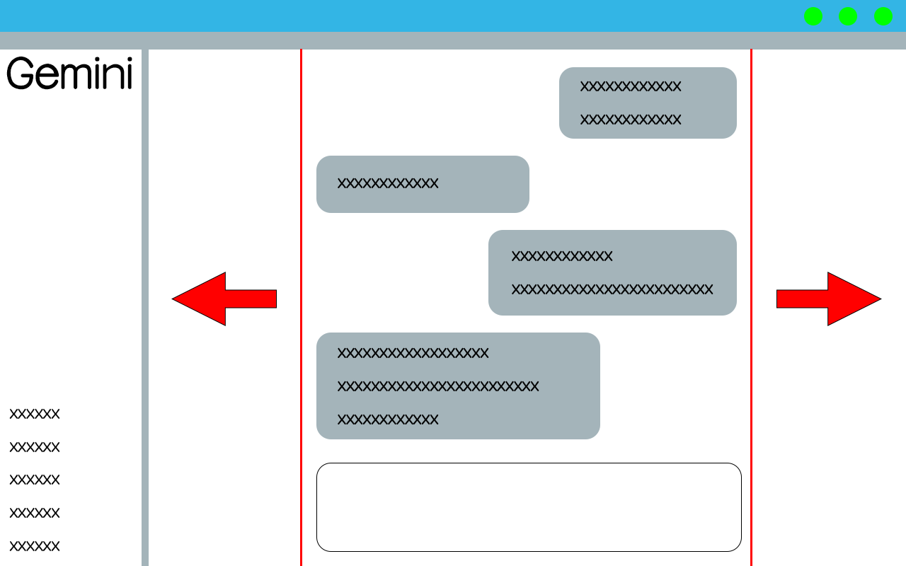

# [B.M] Gemini 優化

[](https://developer.chrome.com/docs/extensions/mv3/)
[](https://gemini.google.com)
[](https://github.com/BoringMan314/bm-gemini-plus)
[](https://github.com/BoringMan314/bm-gemini-plus/releases)
[](LICENSE)

適用於 [Gemini](https://gemini.google.com)（`gemini.google.com`）的瀏覽器擴充功能：把中間對話欄的寬度**往左右拉開**，讓表格、程式碼與長內容不再被壓在畫面中央的窄欄裡。

*为 Gemini（`gemini.google.com`）的对话栏加宽，让表格与长内容不再挤在中间。*<br>
*Gemini（`gemini.google.com`）の会話欄を広げ、表や長文が見切れないようにします。*<br>
*Widens the Gemini (`gemini.google.com`) conversation column so tables and long content are no longer cramped.*

> **聲明**：本專案為第三方輔助工具，與 Google／Gemini 官方無關。使用請遵守該站服務條款。

---



---

## 目錄

- [功能](#功能)
- [系統需求](#系統需求)
- [安裝方式](#安裝方式)
- [本機開發與測試](#本機開發與測試)
- [技術概要](#技術概要)
- [專案結構](#專案結構)
- [版本與多語系](#版本與多語系)
- [隱私說明](#隱私說明)
- [維護者：更新 GitHub 與 Chrome 線上應用程式商店](#維護者更新-github-與-chrome-線上應用程式商店)
- [授權](#授權)
- [問題與建議](#問題與建議)

---

## 功能

- **欄位增寬**：以滑桿調整中間對話欄寬度，`0%` 為 Gemini 原本寬度，`100%` 貼齊到頁面滾動條左側（不會壓到捲軸）。
- **每格 5%**：可按住拖動，但以 5% 為單位跳動，預設 `80%`。
- **一鍵開關**：關閉後完全還原 Gemini 原本版面。
- **表格與程式碼跟著變寬**：表格必要時仍可橫向捲動，不會被裁切。
- **多語系介面**：`zh_TW`、`zh_CN`、`ja`、`en_US`。
- 僅在 **`https://gemini.google.com/*`**、**`https://bard.google.com/*`** 載入，不請求其他網域。

### 使用方式

點擊工具列的擴充功能圖示即可開啟設定：

| 項目 | 說明 |
|------|------|
| 啟用優化 | 總開關；關閉後回到 Gemini 原本版面 |
| 欄位增寬 | `0%`＝Gemini 預設寬度、`100%`＝貼齊滾動條左側，每格 5% |

設定會存於 `chrome.storage.sync`，同一 Google 帳號的瀏覽器之間會同步。

---

## 系統需求

- **Chrome** 或 **Microsoft Edge**（Chromium）等支援 **Manifest V3** 的瀏覽器。

---

## 安裝方式

### 從 Chrome 線上應用程式商店（建議）

請在 [Chrome Web Store](https://chromewebstore.google.com/) 搜尋 **「[B.M] Gemini 優化」** 後安裝。

### 從原始碼載入（開發人員模式）

1. 點選本頁綠色 **Code** → **Download ZIP** 解壓，或執行 `git clone https://github.com/BoringMan314/bm-gemini-plus.git` 複製本倉庫。
2. 以 **Chrome** 或 **Microsoft Edge** 開啟 `chrome://extensions`（在 Edge 為 `edge://extensions`）。
3. 開啟「**開發人員模式**」→「**載入未封裝項目**」→ 選取含 [`manifest.json`](manifest.json) 的**專案根目錄**（勿選子資料夾）。
4. 開啟或重新整理 [Gemini](https://gemini.google.com)，中間欄即會加寬。

---

## 本機開發與測試

修改 [`content.js`](content.js)、[`content.css`](content.css) 或 popup 相關檔案後，在 `chrome://extensions` 將本擴充**重新載入**，再重新整理 Gemini 分頁驗證。

---

## 技術概要

- **內容腳本** [`content.js`](content.js)：先量測 Gemini 原本的對話欄寬度作為 `0%` 基準，再依滑桿百分比線性內插到可用寬度（已扣除滾動條間距），以 `<style>` 與行內樣式覆寫寬度限制；並用 `MutationObserver` 在 Gemini 動態換頁／新訊息時重新套用。
- **靜態樣式** [`content.css`](content.css)：在腳本尚未執行前先放寬外層容器的 `max-width`，減少畫面跳動。
- **設定介面** [`popup.html`](popup.html)／[`popup.js`](popup.js)：讀寫 `chrome.storage.sync`，並以 `chrome.tabs.sendMessage` 即時通知已開啟的 Gemini 分頁。

---

## 專案結構

| 路徑 | 說明 |
|------|------|
| [`manifest.json`](manifest.json) | Manifest V3 設定、比對網址與權限 |
| [`content.js`](content.js) | 量測原寬、計算欄寬並套用樣式的核心邏輯 |
| [`content.css`](content.css) | 放寬外層容器的靜態樣式 |
| [`popup.html`](popup.html) | 設定面板結構 |
| [`popup.css`](popup.css) | 設定面板樣式 |
| [`popup.js`](popup.js) | 設定讀寫、i18n 套用與分頁通知 |
| [`_locales/`](_locales/) | 多語系字串（`zh_TW`、`zh_CN`、`ja`、`en_US`） |
| [`privacy-policy.html`](privacy-policy.html) | 隱私權政策（上架商店所需之公開網頁） |
| [`icons/`](icons/) | 工具列與商店用圖示：`icon16.png`、`icon48.png`、`icon128.png` |
| [`screenshot/`](screenshot/) | 商店與說明用截圖 |

---

## 版本與多語系

- **版本**：以 [`manifest.json`](manifest.json) 的 `version` 為準。
- **預設語系**：`zh_TW`（`default_locale`）。
- **內建語系**：`zh_TW`、`zh_CN`、`ja`、`en_US`（路徑為 `_locales/<code>/messages.json`）。實際顯示依瀏覽器語系與遞減規則。

---

## 隱私說明

本擴充**不蒐集、不上傳**可識別個人之帳戶或對話內容；**未內建**遠端可執行程式、分析或廣告追蹤。僅將「開關」與「欄位增寬百分比」兩項設定存於瀏覽器的 `chrome.storage.sync`。詳見 [`privacy-policy.html`](privacy-policy.html)。

**上架提醒**：若上架 Chrome Web Store，須在開發人員後台完成隱私實踐聲明，並提供本政策之**公開 HTTPS 網址**（建議以 [GitHub Pages](https://pages.github.com/) 託管專案內的 `privacy-policy.html`）。

---

## 維護者：更新 GitHub 與 Chrome 線上應用程式商店

### 更新至 GitHub

**Bash / Git Bash / PowerShell：**

```powershell
git add .
git commit -m "docs: 更新內容說明與商店連結"
git push origin main
```

### 更新至 Chrome 線上應用程式商店

請透過 [Chrome Web Store 開發人員控制台](https://chrome.google.com/webstore/devconsole) 手動上傳更新：

1. **遞增版本**：修改 `manifest.json` 中的 `version`（例如從 `0.1.0` 提升至 `0.1.1`）。
2. **封裝套件**：將專案內容壓縮為 ZIP 檔。
   - **必要檔案**：`manifest.json`, `content.js`, `content.css`, `popup.html`, `popup.css`, `popup.js`, `privacy-policy.html`, `icons/`, `_locales/`
   - **建議不打包**：`.git/`, `.gitignore`, `README.md`, `screenshot/`, `*.psd`, `*.zip`, `*.url`
3. **上傳審核**：在控制台選擇項目 →「套件」→「上傳新套件」。
4. **提交送審**：確認版號、商店文案、截圖、隱私欄位與 `privacy-policy` 公開網址無誤後，點擊「**提交送審**」。

#### 權限用途說明（後台需填寫）

| 權限 | 用途說明 |
|------|----------|
| `storage` | 儲存使用者的開關與欄位增寬百分比設定 |
| `https://gemini.google.com/*`、`https://bard.google.com/*` | 於 Gemini 頁面調整對話欄版面，並在設定變更時通知已開啟的分頁 |

---

## 授權

本專案以 [MIT License](LICENSE) 授權。

---

## 問題與建議

歡迎透過 [GitHub Issues](https://github.com/BoringMan314/bm-gemini-plus/issues) 回報錯誤或提出改善建議。回報時請一併提供瀏覽器版本、**介面語言**及重現步驟。若為 Gemini 改版導致失效，請附上畫面截圖。
